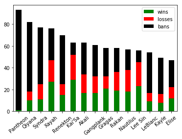
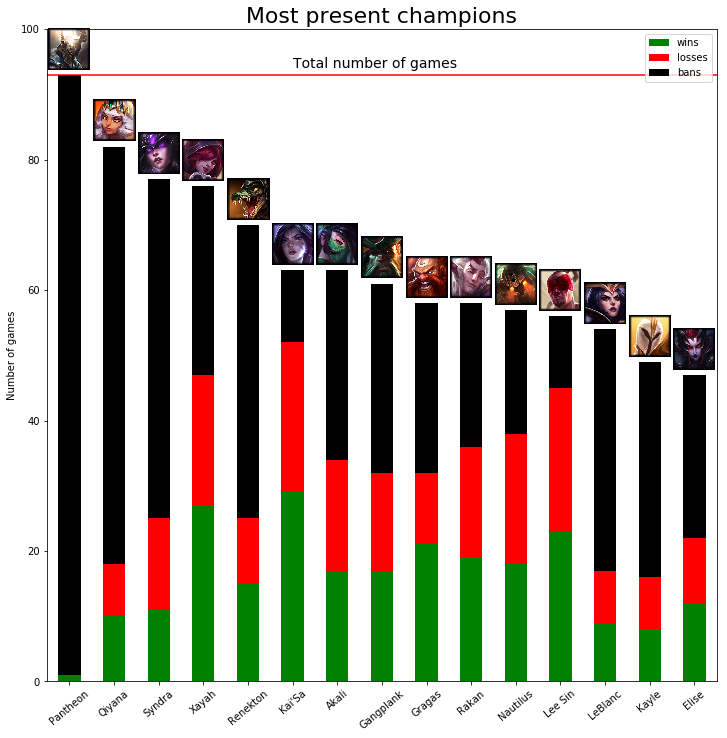
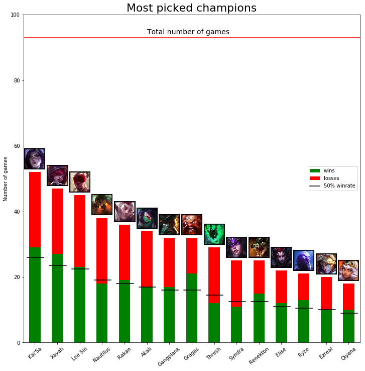

This post will be a simple introduction to the lolesports API and how to make your own stats about matches from Worlds 2019.

You can find the notebook with all the code and the dataset on Github : https://github.com/HextechLab/Worlds2019

## Gather lolesports data

The first thing you need to make stats is data. And in the case of League of Legends esports, the data is not that easily accessible. There are some endpoints used by the lolesports website that are exactly what we want but are not publicly documented, but after some analysis about how the website works, we can understand what are these usefull endpoints.


```python
import requests, json

url_tournament = "http://api.lolesports.com/api/v1/scheduleItems?leagueId=9"
r  = requests.get(url_tournament)
raw_tournament_data = json.loads(r.text)
```


```python
raw_tournament_data.keys()
```


    dict_keys(['scheduleItems', 'highlanderTournaments', 'teams', 'highlanderRecords', 'players'])


Here we are interested in the "highlanderTournaments" field, it contains informations about all Worlds tournaments since 2015. We will focus on the 2019 one : 


```python
worlds_2019 = raw_tournament_data["highlanderTournaments"][4]
worlds_2019.keys()
```


    dict_keys(['id', 'title', 'description', 'leagueReference', 'roles', 'queues', 'rosters', 'published', 'breakpoints', 'brackets', 'liveMatches', 'startDate', 'endDate', 'leagueId', 'platformIds', 'gameIds', 'league'])


We will save the tournament ID for later.


```python
tournament_id = worlds_2019["id"]
```

The bracket field contains most of the information about the structure of the tournament and matches being played in it. Unlike the Riot Games API, matches and games are two differents entities, as matches are what we call B.O. (BO3, BO5...) and are composed by one or more games. We will gather the gameId of each game, the realm (aka server) and the group name for filtering purpose.


```python
brackets = worlds_2019["brackets"]

matches = []
games = {}

for bracket_id in brackets:
    bracket = brackets[bracket_id]
    
    for match_id in bracket["matches"]:
        match = bracket["matches"][match_id]
        
        for game_uuid in match['games']:
            
            game = match['games'][game_uuid]
            
            if 'gameId' in game:
                matches.append(match_id)
                games[game_uuid] = {"matchHistoryId":game['gameId'], "realm":game["gameRealm"], "groupName":bracket["groupName"]}
```


```python
games[next(iter(games.keys()))]
```


    {'matchHistoryId': '1070986',
     'realm': 'ESPORTSTMNT06',
     'groupName': 'play_in_elim'}


## Get the hashes

Esports matches are available on the official match history website.


```python
game = games[next(iter(games.keys()))]

base_match_history_url = "https://matchhistory.na.leagueoflegends.com/en/#match-details/{}/{}"
base_match_history_url.format(game["realm"],game["matchHistoryId"])
```


    'https://matchhistory.na.leagueoflegends.com/en/#match-details/ESPORTSTMNT06/1070986'


However, this link won't work in this state as we miss a hash. Fortunately, we can find this hash in another endpoint.


```python
match_id = next(iter(games.keys()))
base_match_url = "http://api.lolesports.com/api/v2/highlanderMatchDetails?tournamentId={}&matchId={}"
r  = requests.get(base_match_url.format(tournament_id, matches[0]))
match_data = json.loads(r.text)
```


```python
match_data.keys()
```


    dict_keys(['teams', 'players', 'scheduleItems', 'gameIdMappings', 'videos', 'htmlBlocks'])


We can get advanced informations about players, team and even video links of the games. But most importantly for us, we can find the hashes.


```python
for i in match_data["gameIdMappings"]:
    print(i)
```

    {'id': '7a7a436a-43cb-4dc3-b9fe-11d58bcb5c64', 'gameHash': '9e3f5534655e9c51'}
    {'id': 'a00bb3da-8bb1-4adf-a600-1173ac82b80c', 'gameHash': '1230c6f4af180085'}
    {'id': '7bb7c407-878d-4876-baad-1c16542f4983', 'gameHash': '1787d1ea36a382c3'}
    {'id': '98e43133-f89d-4087-a3c6-4ab012d8cba5', 'gameHash': '997c81ff2a1f4f9d'}


Call all the matches to get all hashes.


```python
for match_id in matches:
    r  = requests.get(base_match_url.format(tournament_id,match_id))
    match_data = json.loads(r.text)
    for i in match_data["gameIdMappings"]:
        games[i["id"]]["hash"] = i["gameHash"]
```

With this hash, we are able to make the match history work.


```python
game = games[next(iter(games.keys()))]

base_match_history_url = "https://matchhistory.na.leagueoflegends.com/en/#match-details/{}/{}?gameHash={}"
base_match_history_url.format(game["realm"],game["matchHistoryId"],game["hash"])
```


    'https://matchhistory.na.leagueoflegends.com/en/#match-details/ESPORTSTMNT06/1070986?gameHash=1787d1ea36a382c3'


## Get the match data

Now we have all information needed to gather games data. We will use the ACS, which is the service Riot uses for the match history. URL are of this form : 


```python
base_match_history_stats_url = "https://acs.leagueoflegends.com/v1/stats/game/{}/{}?gameHash={}"
base_match_history_stats_url.format(games[next(iter(games.keys()))]["realm"],games[next(iter(games.keys()))]["matchHistoryId"],games[next(iter(games.keys()))]["hash"])
```


    'https://acs.leagueoflegends.com/v1/stats/game/ESPORTSTMNT06/1070986?gameHash=1787d1ea36a382c3'


ACS shouldn't be used like that and is only tolerated to use for lolesports games as they are not available through the Riot Games API. My best advice here is to call the games one by one to be sure not to reach any rate limit.


```python
all_games_data = {}

for k, v in games.items():
    url = base_match_history_stats_url.format(v["realm"],v["matchHistoryId"],v["hash"])
    all_games_data[k] = requests.get(url).json()
```


```python
len(all_games_data)
```


    93


## Analysis

At this point we have the raw data from all matches of the Worlds 2019. In this example, we will focus on simple stats like banrate, pickrate and winrate.

### Prepare the dataset

Lets define some functions to pick some specific information


```python
def get_team_bans(game_data):
    team_bans = {100:[],200:[]}
    for t in game_data["teams"]:
        for b in t["bans"]:
            team_bans[t["teamId"]].append(b["championId"])
    return team_bans

def get_team_picks(game_data):
    team_picks = {100:[],200:[]}
    for p in game_data["participants"]:
        team_picks[p["teamId"]].append(p["championId"])
    return team_picks
    
def get_team_tag(game_data):
    team_tag = {}
    for p in game_data["participantIdentities"]:
        team_tag[100 if p["participantId"] <= 5 else 200] = p["player"]["summonerName"].split(" ")[0]
    return team_tag
    
role_order = {
    0:"top",
    1:"jungle",
    2:"mid",
    3:"bot",
    4:"supp"
}
```

Using the previously defined functions, create a list where each element is one pick or ban


```python
from static_data import ddragon
dd = ddragon.ddragon()

pick_ban_data = []

for i in all_games_data:
    team_bans = get_team_bans(all_games_data[i])
    team_picks = get_team_picks(all_games_data[i])
    team_tag = get_team_tag(all_games_data[i])
    
    group = games[i]["groupName"]
    for team in [100,200]:
        side = "Blue" if team == 100 else "Red"
        tag = team_tag[team]
        win = all_games_data[i]["teams"][0 if team == 100 else 1]["win"] == "Win"
        
        type_ = "ban"
        for ban in team_bans[team]:
            
            row = {
                "group":group,
                "side":side,
                "tag":tag,
                "win":win,
                "type":type_,
                "championId":ban,
                "champion":dd.getChampion(ban).name
            }
            pick_ban_data.append(row)
        
        type_ = "pick"
        for n_role , pick in enumerate(team_picks[team]):
            
            row = {
                "group":group,
                "side":side,
                "tag":tag,
                "win":win,
                "type":type_,
                "championId":pick,
                "champion":dd.getChampion(pick).name,
                "role":role_order[n_role]
            }
            pick_ban_data.append(row)
```

Manage the list with pandas


```python
import pandas as pd
df = pd.DataFrame(pick_ban_data)
df
```


<div>
<style scoped>
    .dataframe tbody tr th:only-of-type {
        vertical-align: middle;
    }

    .dataframe tbody tr th {
        vertical-align: top;
    }

    .dataframe thead th {
        text-align: right;
    }
</style>
<table border="1" class="dataframe">
  <thead>
    <tr style="text-align: right;">
      <th></th>
      <th>group</th>
      <th>side</th>
      <th>tag</th>
      <th>win</th>
      <th>type</th>
      <th>championId</th>
      <th>champion</th>
      <th>role</th>
    </tr>
  </thead>
  <tbody>
    <tr>
      <td>0</td>
      <td>play_in_elim</td>
      <td>Blue</td>
      <td>HKA</td>
      <td>True</td>
      <td>ban</td>
      <td>79</td>
      <td>Gragas</td>
      <td>NaN</td>
    </tr>
    <tr>
      <td>1</td>
      <td>play_in_elim</td>
      <td>Blue</td>
      <td>HKA</td>
      <td>True</td>
      <td>ban</td>
      <td>18</td>
      <td>Tristana</td>
      <td>NaN</td>
    </tr>
    <tr>
      <td>2</td>
      <td>play_in_elim</td>
      <td>Blue</td>
      <td>HKA</td>
      <td>True</td>
      <td>ban</td>
      <td>41</td>
      <td>Gangplank</td>
      <td>NaN</td>
    </tr>
    <tr>
      <td>3</td>
      <td>play_in_elim</td>
      <td>Blue</td>
      <td>HKA</td>
      <td>True</td>
      <td>ban</td>
      <td>421</td>
      <td>Rek'Sai</td>
      <td>NaN</td>
    </tr>
    <tr>
      <td>4</td>
      <td>play_in_elim</td>
      <td>Blue</td>
      <td>HKA</td>
      <td>True</td>
      <td>ban</td>
      <td>60</td>
      <td>Elise</td>
      <td>NaN</td>
    </tr>
    <tr>
      <td>...</td>
      <td>...</td>
      <td>...</td>
      <td>...</td>
      <td>...</td>
      <td>...</td>
      <td>...</td>
      <td>...</td>
      <td>...</td>
    </tr>
    <tr>
      <td>1854</td>
      <td>play_in_groups</td>
      <td>Red</td>
      <td>MG</td>
      <td>False</td>
      <td>pick</td>
      <td>84</td>
      <td>Akali</td>
      <td>top</td>
    </tr>
    <tr>
      <td>1855</td>
      <td>play_in_groups</td>
      <td>Red</td>
      <td>MG</td>
      <td>False</td>
      <td>pick</td>
      <td>59</td>
      <td>Jarvan IV</td>
      <td>jungle</td>
    </tr>
    <tr>
      <td>1856</td>
      <td>play_in_groups</td>
      <td>Red</td>
      <td>MG</td>
      <td>False</td>
      <td>pick</td>
      <td>3</td>
      <td>Galio</td>
      <td>mid</td>
    </tr>
    <tr>
      <td>1857</td>
      <td>play_in_groups</td>
      <td>Red</td>
      <td>MG</td>
      <td>False</td>
      <td>pick</td>
      <td>498</td>
      <td>Xayah</td>
      <td>bot</td>
    </tr>
    <tr>
      <td>1858</td>
      <td>play_in_groups</td>
      <td>Red</td>
      <td>MG</td>
      <td>False</td>
      <td>pick</td>
      <td>111</td>
      <td>Nautilus</td>
      <td>supp</td>
    </tr>
  </tbody>
</table>
<p>1859 rows × 8 columns</p>
</div>


### Manipulate the dataset

Calculate the banrate of champions


```python
banrate = (
    # Selecting bans
    df[df["type"] == "ban"]
        # We want champions
        .groupby("champion")
        .count()
        # Sorted by most banned champions
        .sort_values("championId", ascending=False)
        ["championId"]
        # Divided by number of games to get a percentage
        /len(games)
)

banrate.head(10)
```


    champion
    Pantheon     0.989247
    Qiyana       0.688172
    Syndra       0.559140
    Renekton     0.483871
    LeBlanc      0.397849
    Kayle        0.354839
    Akali        0.311828
    Xayah        0.311828
    Gangplank    0.311828
    Gragas       0.279570
    Name: championId, dtype: float64


Calculate the pickrate of champions


```python
pickrate = (
    # Selecting picks
    df[df["type"] == "pick"]
        # We want champions
        .groupby("champion")
        .count()
        # Sorted by most picked champions
        .sort_values("championId", ascending=False)
        ["championId"]
        # Divided by number of games to get a percentage
        /len(games)
)

pickrate.head(10)
```


    champion
    Kai'Sa       0.559140
    Xayah        0.505376
    Lee Sin      0.483871
    Nautilus     0.408602
    Rakan        0.387097
    Akali        0.365591
    Gragas       0.344086
    Gangplank    0.344086
    Thresh       0.311828
    Renekton     0.268817
    Name: championId, dtype: float64


Calculate the winrate


```python
wins = (
    # Selecting picks
    df[((df["type"] == "pick") & (df["win"]))]
        # We want champions
        .groupby("champion")
        .count()
        # Sorted by most picked champions
        .sort_values("championId", ascending=False)
        ["championId"]
)

picks = (
    # Selecting picks
    df[df["type"] == "pick"]
        # We want champions
        .groupby("champion")
        .count()
        # Sorted by most picked champions
        .sort_values("championId", ascending=False)
        ["championId"]
)

winrate = (wins/picks).fillna(0).sort_values(ascending=False)
winrate.head(10)
```


    champion
    Malphite        1.000000
    Vayne           1.000000
    Draven          1.000000
    Poppy           1.000000
    Pantheon        1.000000
    Urgot           1.000000
    Fiddlesticks    1.000000
    Varus           1.000000
    Jax             1.000000
    Taliyah         0.857143
    Name: championId, dtype: float64


Calculate the presence


```python
presence = pickrate.add(banrate, fill_value=0)
presence
```


    champion
    Aatrox     0.129032
    Akali      0.677419
    Alistar    0.161290
    Anivia     0.010753
    Ashe       0.075269
                 ...   
    Yasuo      0.236559
    Yuumi      0.376344
    Ziggs      0.010753
    Zilean     0.010753
    Zoe        0.053763
    Name: championId, Length: 96, dtype: float64


Combine all of this and add the presence rate in a new dataframe


```python
df2 = pd.DataFrame([banrate,pickrate,winrate, presence]).T.fillna(0)
df2.columns = ["banrate", "pickrate", "winrate", "presence"]

df2
```


<div>
<style scoped>
    .dataframe tbody tr th:only-of-type {
        vertical-align: middle;
    }

    .dataframe tbody tr th {
        vertical-align: top;
    }

    .dataframe thead th {
        text-align: right;
    }
</style>
<table border="1" class="dataframe">
  <thead>
    <tr style="text-align: right;">
      <th></th>
      <th>banrate</th>
      <th>pickrate</th>
      <th>winrate</th>
      <th>presence</th>
    </tr>
  </thead>
  <tbody>
    <tr>
      <td>Pantheon</td>
      <td>0.989247</td>
      <td>0.010753</td>
      <td>1.000000</td>
      <td>1.000000</td>
    </tr>
    <tr>
      <td>Qiyana</td>
      <td>0.688172</td>
      <td>0.193548</td>
      <td>0.555556</td>
      <td>0.881720</td>
    </tr>
    <tr>
      <td>Syndra</td>
      <td>0.559140</td>
      <td>0.268817</td>
      <td>0.440000</td>
      <td>0.827957</td>
    </tr>
    <tr>
      <td>Renekton</td>
      <td>0.483871</td>
      <td>0.268817</td>
      <td>0.600000</td>
      <td>0.752688</td>
    </tr>
    <tr>
      <td>LeBlanc</td>
      <td>0.397849</td>
      <td>0.182796</td>
      <td>0.529412</td>
      <td>0.580645</td>
    </tr>
    <tr>
      <td>...</td>
      <td>...</td>
      <td>...</td>
      <td>...</td>
      <td>...</td>
    </tr>
    <tr>
      <td>Sona</td>
      <td>0.000000</td>
      <td>0.010753</td>
      <td>0.000000</td>
      <td>0.010753</td>
    </tr>
    <tr>
      <td>Poppy</td>
      <td>0.000000</td>
      <td>0.010753</td>
      <td>1.000000</td>
      <td>0.010753</td>
    </tr>
    <tr>
      <td>Lulu</td>
      <td>0.000000</td>
      <td>0.010753</td>
      <td>0.000000</td>
      <td>0.010753</td>
    </tr>
    <tr>
      <td>Lux</td>
      <td>0.000000</td>
      <td>0.010753</td>
      <td>0.000000</td>
      <td>0.010753</td>
    </tr>
    <tr>
      <td>Malphite</td>
      <td>0.000000</td>
      <td>0.010753</td>
      <td>1.000000</td>
      <td>0.010753</td>
    </tr>
  </tbody>
</table>
<p>96 rows × 4 columns</p>
</div>


Sort the dataframe how you want


```python
df2.sort_values("presence",ascending=False)
```


<div>
<style scoped>
    .dataframe tbody tr th:only-of-type {
        vertical-align: middle;
    }

    .dataframe tbody tr th {
        vertical-align: top;
    }

    .dataframe thead th {
        text-align: right;
    }
</style>
<table border="1" class="dataframe">
  <thead>
    <tr style="text-align: right;">
      <th></th>
      <th>banrate</th>
      <th>pickrate</th>
      <th>winrate</th>
      <th>presence</th>
    </tr>
  </thead>
  <tbody>
    <tr>
      <td>Pantheon</td>
      <td>0.989247</td>
      <td>0.010753</td>
      <td>1.000000</td>
      <td>1.000000</td>
    </tr>
    <tr>
      <td>Qiyana</td>
      <td>0.688172</td>
      <td>0.193548</td>
      <td>0.555556</td>
      <td>0.881720</td>
    </tr>
    <tr>
      <td>Syndra</td>
      <td>0.559140</td>
      <td>0.268817</td>
      <td>0.440000</td>
      <td>0.827957</td>
    </tr>
    <tr>
      <td>Xayah</td>
      <td>0.311828</td>
      <td>0.505376</td>
      <td>0.574468</td>
      <td>0.817204</td>
    </tr>
    <tr>
      <td>Renekton</td>
      <td>0.483871</td>
      <td>0.268817</td>
      <td>0.600000</td>
      <td>0.752688</td>
    </tr>
    <tr>
      <td>...</td>
      <td>...</td>
      <td>...</td>
      <td>...</td>
      <td>...</td>
    </tr>
    <tr>
      <td>Ziggs</td>
      <td>0.000000</td>
      <td>0.010753</td>
      <td>0.000000</td>
      <td>0.010753</td>
    </tr>
    <tr>
      <td>Anivia</td>
      <td>0.000000</td>
      <td>0.010753</td>
      <td>0.000000</td>
      <td>0.010753</td>
    </tr>
    <tr>
      <td>Xin Zhao</td>
      <td>0.000000</td>
      <td>0.010753</td>
      <td>0.000000</td>
      <td>0.010753</td>
    </tr>
    <tr>
      <td>Kalista</td>
      <td>0.010753</td>
      <td>0.000000</td>
      <td>0.000000</td>
      <td>0.010753</td>
    </tr>
    <tr>
      <td>Malphite</td>
      <td>0.000000</td>
      <td>0.010753</td>
      <td>1.000000</td>
      <td>0.010753</td>
    </tr>
  </tbody>
</table>
<p>96 rows × 4 columns</p>
</div>


### Visualize the data

Having graphs is good too, so we'll create a bar chart with wins, losses and bans. We'll create another dataframe for this purpose.


```python
bans = (
    # Selecting bans
    df[df["type"] == "ban"]
        # We want champions
        .groupby("champion")
        .count()
        # Sorted by most banned champions
        .sort_values("championId", ascending=False)
        ["championId"]
)

wins = (
    # Selecting picks
    df[((df["type"] == "pick") & (df["win"]))]
        # We want champions
        .groupby("champion")
        .count()
        # Sorted by most picked champions
        .sort_values("championId", ascending=False)
        ["championId"]
)

picks = (
    # Selecting picks
    df[df["type"] == "pick"]
        # We want champions
        .groupby("champion")
        .count()
        # Sorted by most picked champions
        .sort_values("championId", ascending=False)
        ["championId"]
)

losses = picks - wins

presence = picks+bans

df3 = pd.DataFrame([picks, wins, losses, bans, presence]).T.fillna(0)
df3.columns = ["picks", "wins", "losses", "bans", "presence"]
df3
```


<div>
<style scoped>
    .dataframe tbody tr th:only-of-type {
        vertical-align: middle;
    }

    .dataframe tbody tr th {
        vertical-align: top;
    }

    .dataframe thead th {
        text-align: right;
    }
</style>
<table border="1" class="dataframe">
  <thead>
    <tr style="text-align: right;">
      <th></th>
      <th>picks</th>
      <th>wins</th>
      <th>losses</th>
      <th>bans</th>
      <th>presence</th>
    </tr>
  </thead>
  <tbody>
    <tr>
      <td>Kai'Sa</td>
      <td>52.0</td>
      <td>29.0</td>
      <td>23.0</td>
      <td>11.0</td>
      <td>63.0</td>
    </tr>
    <tr>
      <td>Xayah</td>
      <td>47.0</td>
      <td>27.0</td>
      <td>20.0</td>
      <td>29.0</td>
      <td>76.0</td>
    </tr>
    <tr>
      <td>Lee Sin</td>
      <td>45.0</td>
      <td>23.0</td>
      <td>22.0</td>
      <td>11.0</td>
      <td>56.0</td>
    </tr>
    <tr>
      <td>Nautilus</td>
      <td>38.0</td>
      <td>18.0</td>
      <td>20.0</td>
      <td>19.0</td>
      <td>57.0</td>
    </tr>
    <tr>
      <td>Rakan</td>
      <td>36.0</td>
      <td>19.0</td>
      <td>17.0</td>
      <td>22.0</td>
      <td>58.0</td>
    </tr>
    <tr>
      <td>...</td>
      <td>...</td>
      <td>...</td>
      <td>...</td>
      <td>...</td>
      <td>...</td>
    </tr>
    <tr>
      <td>Pantheon</td>
      <td>1.0</td>
      <td>1.0</td>
      <td>0.0</td>
      <td>92.0</td>
      <td>93.0</td>
    </tr>
    <tr>
      <td>Lulu</td>
      <td>1.0</td>
      <td>0.0</td>
      <td>0.0</td>
      <td>0.0</td>
      <td>0.0</td>
    </tr>
    <tr>
      <td>Lux</td>
      <td>1.0</td>
      <td>0.0</td>
      <td>0.0</td>
      <td>0.0</td>
      <td>0.0</td>
    </tr>
    <tr>
      <td>Malphite</td>
      <td>1.0</td>
      <td>1.0</td>
      <td>0.0</td>
      <td>0.0</td>
      <td>0.0</td>
    </tr>
    <tr>
      <td>Kalista</td>
      <td>0.0</td>
      <td>0.0</td>
      <td>0.0</td>
      <td>1.0</td>
      <td>0.0</td>
    </tr>
  </tbody>
</table>
<p>96 rows × 5 columns</p>
</div>


Here is a stacked bar graph to represent the 15 most present champions that have been picked or ban.


```python
# Sorting the dataframe, first items are the most present
df3.sort_values("presence", ascending=False, inplace=True)

# Take only the interesting columns for the graph
sorted_champions =  df3[["wins", "losses", "bans"]]

# Take the top 15
top_sorted_champions = sorted_champions[:15]

#Plot the result as stacked bar, change the colors at will, rot=40 being the label rotaion at the bottom
top_sorted_champions.plot(kind="bar", stacked=True, color=["green","red","black"], rot=40)
```


    <matplotlib.axes._subplots.AxesSubplot at 0x7fa8eff49160>





The graph is nice and all, but we always can do better, and a little customization like adding champion icon and other details is possible.


```python
import matplotlib.image as mpimg
from matplotlib.offsetbox import TextArea, DrawingArea, OffsetImage, AnnotationBbox
```


```python
top_number = 15

# Sort champions by presence and select the top
df_champions_presence = df3.sort_values("presence", ascending=False)[:top_number]

# Define the graph like previously, but make it larger
plt = df_champions_presence[["wins", "losses", "bans"]].plot(kind="bar", stacked=True, color=["green","red","black"], rot=40, figsize=(12,12), ylim=(0,100))

# Add a line to represent the maximum number of time a champion could have been picked or banned
plt.axhline(y=len(all_games_data), color='r', linestyle='-')
plt.text(5, 94, "Total number of games", fontsize=14)

# Always add titles
plt.set_ylabel('Number of games')

plt.set_title("Most present champions", fontsize=22)

# For each champion, we add its icon on top of the bar
position = 0
for champion,stats in df_champions_presence.iterrows():
    
    # Get the image url and fit it in a "box"
    image = mpimg.imread(dd.getChampion(champion).image)
    imagebox = OffsetImage(image, zoom=0.35)
    
    # Position the box where it should 
    ab = AnnotationBbox(imagebox, (position, stats["presence"] + 4), frameon=False)
    
    # Add the box to the graph
    plt.add_artist(ab)

    position += 1


plt
```


    <matplotlib.axes._subplots.AxesSubplot at 0x7fa8ef6bdf98>





For the fun, make another graph with the champions sorted by picks and remove the bans.


```python
# Sort champions by pick and select the top
df_champions_pick = df3.sort_values("picks", ascending=False)[:top_number]

# Define the graph
plt = df_champions_pick[["wins", "losses"]].plot(kind="bar", stacked=True, color=["green","red"], rot=40, figsize=(12,12), ylim=(0,100))

# Add the line for the number of games
plt.axhline(y=len(all_games_data), color='r', linestyle='-')
plt.text(5, 94, "Total number of games", fontsize=14)

# Always add titles
plt.set_ylabel('Number of games')

plt.set_title("Most picked champions", fontsize=22)

# Add the icon for each champion
position = 0
for champion,stats in df_champions_pick.iterrows():
    
    # Get the image url and fit it in a "box"
    image = mpimg.imread(dd.getChampion(champion).image)
    imagebox = OffsetImage(image, zoom=0.35)
    
    # Position the box where it should 
    ab = AnnotationBbox(imagebox, (position, stats["picks"] + 4), frameon=False)
    
    # Add the box to the graph
    plt.add_artist(ab)
    
    
    v_position = position/top_number
    
    #Another usefull detail, add a line to represent half the picks, to show if the champion has a high winrate or not
    plt.axhline(y=stats["picks"]/2, color='black', linestyle='-', xmin=v_position+0.01, xmax=v_position+0.06)

    position += 1
    
# Update the legend to match the 50% winrate line
from matplotlib.lines import Line2D

handles, labels = plt.get_legend_handles_labels()
handles.append(Line2D([0], [0], color="black"))
labels.append("50% winrate")

plt.legend(handles, labels)

plt
```


    <matplotlib.axes._subplots.AxesSubplot at 0x7fa8eda9c3c8>





That's all for today, now you have the data, you know how to extract information from the data, and how to present it. It's your turn to practice and tell me who is the best KDA player or the best farmer.
